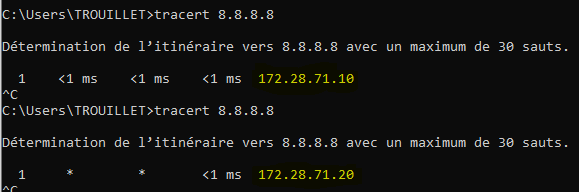

# Compte Rendu de l'Activation de HSRP sur un Cisco 1950
HSRP (Hot Standby Router Protocol) est un protocole de haute disponibilité qui permet de créer une passerelle virtuelle redondante entre plusieurs routeurs. Cela garantit une disponibilité élevée pour les réseaux en redirigeant le trafic vers un routeur de secours en cas de défaillance du routeur actif.
## Étapes :

1. **Activation du mode enable :** Pour accéder au mode de configuration , il est necessaire de passer en mode de configuration privilégié avec la commande `enable`.

2. **Configuration de l'interface pour HSRP :** Une fois en `conf t`, nous irons dans la configuration de l'interface `Gi0/0.233 (notre interface de transport)`. Une fois dans ce mode nous effecturons les commandes suivantes:
`standby 1 ip 172.28.71.254` qui definit l'adresse VIP (Virtual IP) HSRP à 172.28.71.254 `standby 1 priority 110` qui definit la priorité du routeur à 110 qui sera superieur a celui de R2 qui est 100 , `standby 1 preempt` permet de reprendre le rôle de base pour R1 donc actif et R2 reviendra a passif.

Et voilà , HSRP est desormais actif et fonctionnel .

