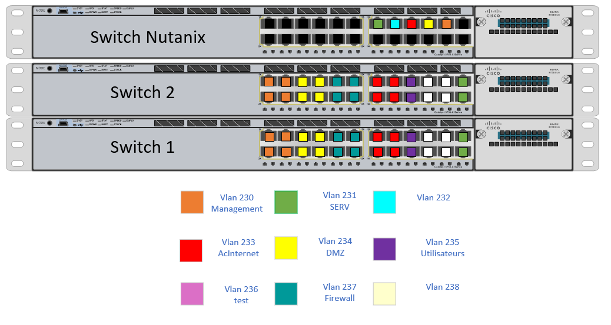

# **Plan d'adressage du réseau**

L'entièreté des sites est basée sur l'adresse IP **`172.28.0.0 /16`**. 

Dû à la taille de l'entreprise, nous avons décidé d'utiliser comme masque de sous-réseau **`/19`**, permettant d'avoir 8 VLAN disponibles. 

Laissant ainsi à l'entreprise de la place pour se développer et intégrer de nouveaux sites à son infrastructure.
 

## **Réseau de Chartres**

| Nom de Réseau | @Réseau | @Diffusion | CIDR |
|---------------|---------|------------|------|
| Chartres | 172.28.64.0 | 172.28.95.255 | /19

 

## VLANs assignés

| Nom Vlan | @Réseau | @Diffusion | CIDR |  VLANs assignés |
|----|----------|--------|----------------|----------------------|
| Management | 172.28.64.0 | 172.28.64.255 | /24 | 230
| SRV | 172.28.65.0 | 172.28.65.255 | /24 | 231
| AcInternet | 172.28.71.0 | 172.28.71.255 | /24 | 233
| DMZ | 192.168.28.0 | 192.168.28.255 | /24 | 234
| Utilisateurs | 172.28.85.0 | 172.28.85.255 | /24 | 235
| firewall | 172.28.70.0 | 172.28.70.255 | /24 | 237

## VLAN 230 (Management / Administration)

| Nom Hôte | @IP |
|----------|-----|
| Switch   | 172.28.64.254               
| Hôte Management | 172.28.64.1 
| CHA-DMZ | 192.168.28.1 
| SRV | 172.28.64.100
| R1-CHA | 172.28.64.10  
| R2-CHA| 172.28.64.20 
 
 
Interface disponible pour le `Management` : ` Gi 1/0/1 à 1/0/4 ` Et ` Gi 2/0/1 à 1/0/4 ` 
 

## VLAN 231 (Serveurs Locaux)

| Nom Hôte | @IP | Passerelle|
|----------|-----|--------|
| SRV | 172.28.65.1 | 172.28.65.254 | 

 
Interface disponible pour le `Serveur` : ` Gi 1/0/23 à 1/0/24 ` Et ` Gi 2/0/23 à 1/0/24 ` 
 

## VLAN 233

| Nom Hôte | @IP |  
|----------|-----|
| Switch | 172.28.71.1 | 
| R1-CHA | 172.28.71.10 |
| R2-CHA | 172.28.71.20 | 

 
Interface disponible pour l' `AcInternet` : ` Gi 1/0/13 à 1/0/16 ` Et ` Gi 2/0/13 à 1/0/16 ` 
 
Interface en mode Trunk : ` Gi 1/0/13 ` Et ` Gi 2/0/13 `
 
VIP : ` 172.28.71.254 ` 

## VLAN 234 (DMZ)

| Nom Hôte | @IP | Passerelle    |
|----------|-----|---------------|
| CHA-DMZ  | 192.168.28.1 | 192.168.28.254 |

 
Interface disponible pour la `DMZ` : ` Gi 1/0/5 à 1/0/8 ` Et ` Gi 2/0/5 à 1/0/8 ` 
 

## VLAN 235

| Nom Hôte | @IP | Passerelle    | DNS | 
|----------|-----|---------------|-----|
| Utilisateur Test | DHCP (.85.0) | 172.28.85.254 | 172.28.65.1 |

 
Interface disponible pour l' `AcInternet` : ` Gi 1/0/17 à 1/0/18 ` Et ` Gi 2/0/17 à 1/0/18 ` 
 

## VLAN 237

| Nom Hôte | @IP               | Passerelle    |  
|----------|-------------------|---------------|
| Switch   | 172.28.70.254     | 172.28.70.254 |  
| stormshield | 172.28.70.253 | 172.28.70.254 | 

 
Interface disponible pour l' `StormShield` : ` Gi 1/0/9 à 1/0/12 ` Et ` Gi 2/0/9 à 1/0/12 ` 
 

## DNS

nom de domaine réseau privé : local.chartres.sportludique.fr