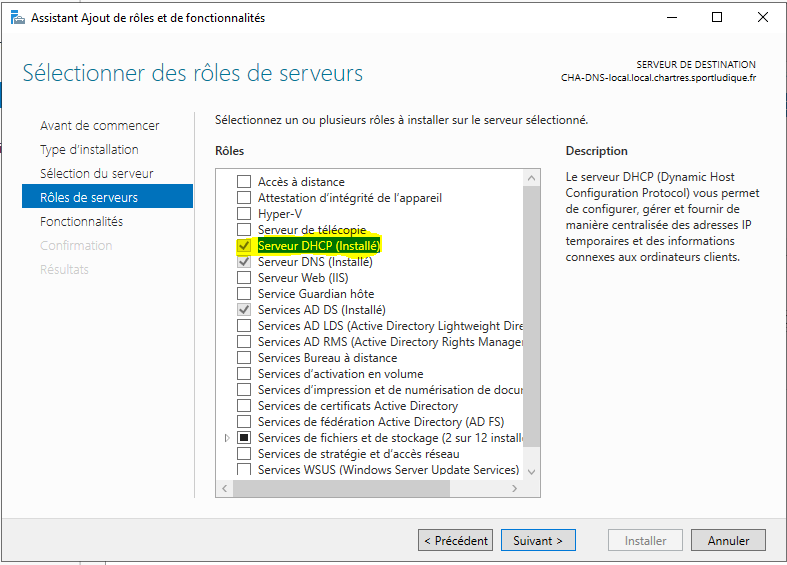
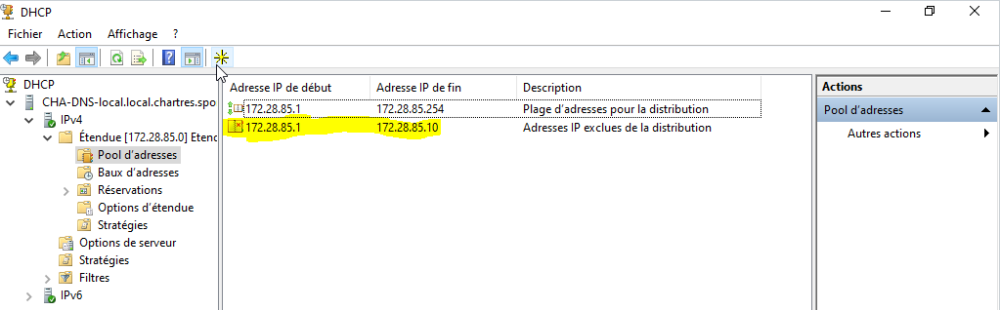
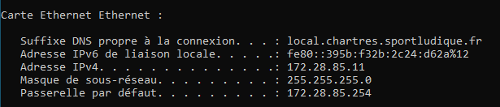

# Configuration DHCP

## Introduction
 
Après avoir installé le DNS, il faudra installer un service DHCP pour attribuer des adresses aux hôtes présents dans le réseau. Notamment ceux du VLAN 235 (Utilisateurs locaux du serveur privé) qui n'ont aucun serveur dans leur VLAN. Il faudra donc créer une plage s'adaptant au réseau que l'on a attribué à ce VLAN.
 

## Ajout du service et création de la plage
 
Pour commencer, je me suis rendu dans Gestion et Ajout des Rôles et services puis j'ai sélectionné DHCP.
 

 

Après avoir installé le rôle, il me suffira de me rendre dans la configuration du DHCP et de créer la plage dans l'onglet IPv4. Voici un rappel de la plage que je vais intégrer à mon serveur DHCP :

 

| @Plage de début | CIDR | @Plage de fin | @Passerelle | @DNS | Plage exclue |
|-----------------|------|---------------|-------------|------|--------------|
| 172.28.85.1     | /24  | 172.28.85.253 | 172.28.85.254 | 172.28.65.1 | 85.1 - 85.10

 

On a décidé d'exclure 10 adresses pour nous permettre d'accéder au réseau privé en cas de panne et ainsi être sûr d'avoir des adresses IP disponibles.

Une fois dans le menu d'ajout de l'étendue, il faudra cliquer sur suivant avant d'atteindre la fenêtre présente ci-dessous (L'erreur d'adresse IP de fin a été corrigée. Bien que cela ne nous aurait pas posé de soucis puisque nous n'avons pas beaucoup de machine et le DHCP va toujours commencer avec 172.28.85.1).

 
Preuve de la correction réalisée :

 

 

Étant donné que la plupart des menus sont identiques, je compte uniquement ajouter la fenêtre lors de la configuration du routeur.
Il suffit d'ajouter l'adresse de la passerelle et de cliquer sur le bouton "Ajouter".
 

Il suffira ensuite de continuer la configuration en respectant les paramètres ayant été mis en place auparavant, dans le tableau en haut de la page.

Désormais, il faut vérifier si le serveur a été configuré correctement. On va devoir réaliser un test sur une machine VirtualBox qui est connectée au VLAN 235 via nos switchs.

## Test du DHCP sur une machine cliente

Nous avons donc lancé une VM Windows 10 en s'assurant d'être en mode **Réseau privé hôte**. Une fois la VM lancée, on se rend dans les paramètres de celle-ci pour modifier les paramètres IPv4 et mettre l'adresse du serveur DNS (**172.28.65.1**).

 
Une fois que c'est fait, on s'est rendu dans le CMD et nous avons éxecuter un ipconfig/release et un /renew avant de refaire un autre ipconfig pour ainsi voir si le serveur DHCP a bel et bien attribué les paramètres au poste.

Le poste a bel et bien reçu une adresse IP rentrant dans la plage et en dehors de la plage exclue, le masque et la passerelle sont corrects. L'installation du DHCP est réussie.