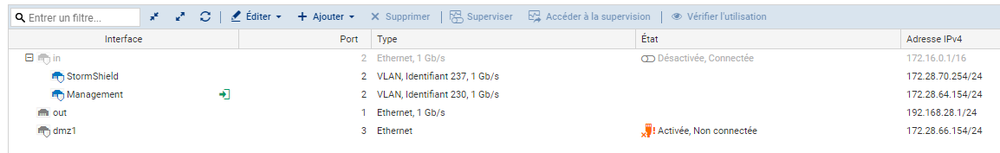

# Configuration du Firewall physique de transport

## Plages utilisées

| Nom Port | @IP | VLAN |
|----------|-----|------|
| IN | 172.16.0.1 /16 | ❌ |
| Stormshield | 172.28.70.254 /24 | 237 |
| Management | 172.28.64.154 /24 | 230 |
| OUT | 192.168.28.1 /24 | ❌ |
| DMZ | 172.28.66.154 /24 | ❌ |

## Connexion au firewall

IP du firewall par défaut : 10.0.0.254 (DHCP ACTIF)
 
login + mdp : admin

## Modifier le mot de passe de l'administrateur

SYSTÈME -> Administrateurs -> COMPTE ADMIN

## Modifier les adresses IP des ports

RÉSEAU -> Interfaces

## Créer des VLAN

Cliquer sur le port souhaité puis AJOUTER -> VLAN -> pour (port)

⚠️ Ne pas désactiver l'interface IN tant que l'on est pas sûr du fonctionnement des VLAN

VLANs ayant été ajoutés :

## Gérer les accès à l'administration

SYSTÈME -> Configuration -> ADMINISTRATION 

⚠️ Uniquement les membres du VLAN auront besoin d'avoir accès au Firewall