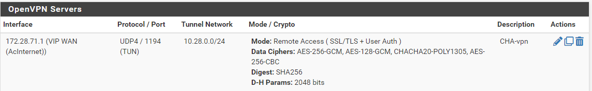
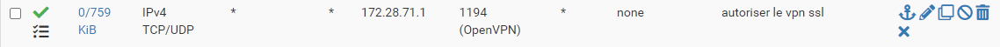
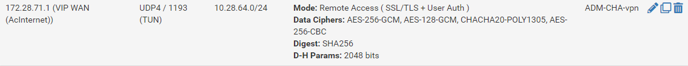

# Configuration des VPN 
## Sur le PFsense

#### Configuration du VPN Utilisateurs 

 
suivi du tuto de [IT connect](https://www.it-connect.fr/pfsense-configurer-un-vpn-ssl-client-to-site-avec-openvpn/) 

⚠️ Notre réseau utilise `2 pfsense` donc lors de la configuration de la règle `wan` il faut ` préciser la VIP 172.28.71.1`
ainsi que dans la `configuration du serveur VPN` mettre l'`accès VPN` sur `celle ci` ⚠️

Serveur VPN pour les utilisateurs
écoute le port 1194

règle de filtrage pour le port 1194

#### Configuration du VPN Admin

Serveur VPN pour les administrateurs
écoute le port 1193

règle de filtrage pour le port 1193

création d'utilisateur admin 

