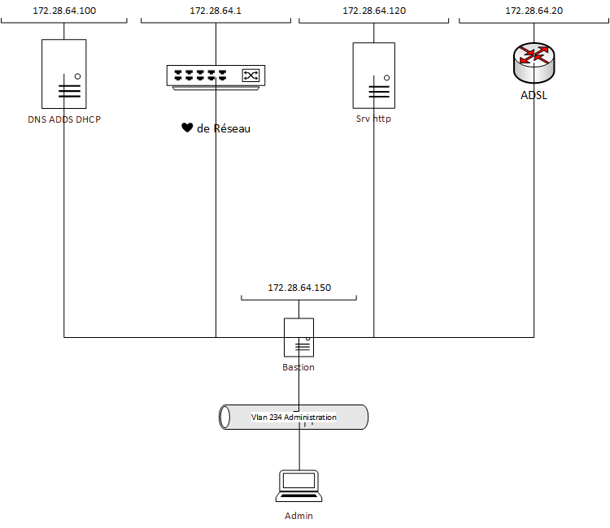

Mise en place d'un Bastion Guacamole dans le Vlan de management 

Suivi du tuto [Apache Guacamole, un bastion d’administration pour vos accès RDP, SSH, etc.](https://www.it-connect.fr/tuto-apache-guacamole-bastion-rdp-ssh-debian/) 

les problèmes rencontrés : 

- versioning : la version 1.5.4 de guacamole et tomcat10 ne sont pas compatible debian12 donc utilisation de debian11, tomcat9 et guacamole 1.5.2

- il manquait la bibliothéque libguac-client-ssh0

