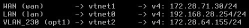

## Configuration du PfSense

Pour la règle de NAT comme port traduit , nous avons donc pris notre interface LAN qui est celle en 192.168 et donc celle qui n'est pas exposé a internet , pour n'importe quel protocole , n'importe quel adresse source , ports source , adresse de destination et ports de destination , l'adresse sera traduite avec l'ip du WAN qui est 172.28.71.30 pour n'importe quel port

Nous avons ping avec un ordinateur en 192.168.28.x pour voir si la règle fonctionne,172.28.71.30 etant notre Pfsense et 8.8.8.8 la destination du ping donc notre ip est bien translaté

[Conf du pfSense ici](../../../utilitaire/Conf-pfSense/conf-pfSense-Chartres-06-11-23.txt)