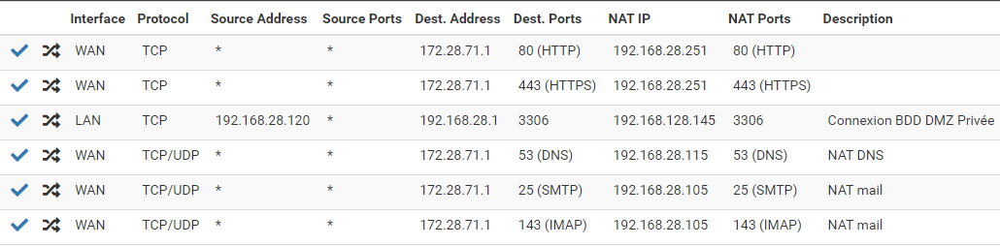

# Règles NAT 

## Règle NAT du routeur 1

| protocole |     @Ip      | port | interface | port |      
|-----------|--------------|------|-----------|------|  
|    TCP    | 172.28.71.1  |  80  |  Gi 0/1   |  80  |
|    TCP    | 172.28.71.1  |  53  |  Gi 0/1   |  53  |
|    TCP    | 172.28.71.1  |  53  |  Gi 0/1   |  53  |
|    TCP    | 172.28.71.1  |  1194  |  Gi 0/1   |  1194  |
|    TCP    | 172.28.71.1  |  1194  |  Gi 0/1   |  1194  |
|    TCP    | 172.28.71.1  |  1194  |  Gi 0/1   |  1194  |
|    TCP    | 172.28.71.1  |  1194  |  Gi 0/1   |  1194  |
|    TCP    | 172.28.71.1  |  25  |  Gi 0/1   |  25  |
|    TCP    | 172.28.71.1  |  143  |  Gi 0/1   |  143  |
|    TCP    | 172.28.71.1  |  443  |  Gi 0/1   |  443  |

## Règle NAT du routeur 2

| protocole |     @Ip      | port | interface | port |      
|-----------|--------------|------|-----------|------|  
|    TCP    | 172.28.71.1  |  80  |  Gi 0/1   |  80  |
|    TCP    | 172.28.71.1  |  53  |  Gi 0/1   |  53  |
|    TCP    | 172.28.71.1  |  53  |  Gi 0/1   |  53  |
|    TCP    | 172.28.71.1  |  1194  |  Gi 0/1   |  1194  |
|    TCP    | 172.28.71.1  |  1194  |  Gi 0/1   |  1194  |
|    TCP    | 172.28.71.1  |  1194  |  Gi 0/1   |  1194  |
|    TCP    | 172.28.71.1  |  1194  |  Gi 0/1   |  1194  |
|    TCP    | 172.28.71.1  |  25  |  Gi 0/1   |  25  |
|    TCP    | 172.28.71.1  |  143  |  Gi 0/1   |  143  |
|    TCP    | 172.28.71.1  |  443  |  Gi 0/1   |  443  |

## Règles NAT sur le pf Sense

