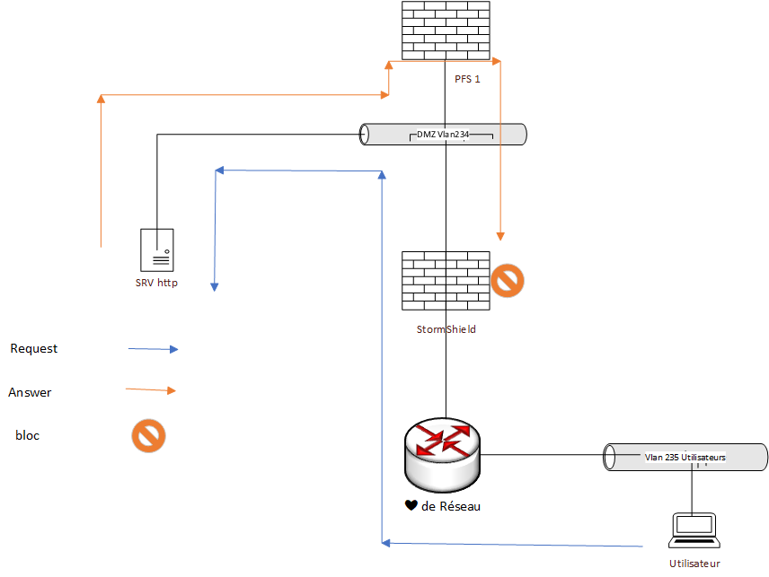

# Règles de routages

## Routeur 1

|   @Ip destinations   |     masque    |    gateway     |      
|----------------|---------------|----------------|  
|     0.0.0.0    |    0.0.0.0    |  183.44.28.2   |
|   10.28.64.0   | 255.255.255.0 |  172.28.64.155 |
|  172.28.64.0   | 255.255.224.0 |  172.28.71.1   |

## Routeur 2 

|   @Ip destination   |     masque    |    gateway     |      
|----------------|---------------|----------------|  
|     0.0.0.0    |    0.0.0.0    |  221.87.128.1  |
|   10.28.64.0   | 255.255.255.0 |  172.28.64.155 |
|  172.28.64.0   | 255.255.224.0 |  172.28.71.1   |

## Pfsense 

#### ICMP redirect : 
Nous avons fait face à un problème de icmp redirect 
puisque la gateway des serveurs present dans la dmz est par définition 192.168.28.254 lorque les utilisateurs interne essayer d'acceder à un service de la dmz comme par exemple le site web, la réponsse du serveur fait un détour par la gateway puis au niveau du stormshield celui ci bloque.

{: width="650px" height="450px"}

## Serveur DMZ 

Une route est appliquer à chaque serveur de la DMZ pour que les utilisateur interne puisse utiliser les services

|   @Ip destination   |     masque    |    gateway     |      
|----------------|---------------|----------------|  
|   172.28.71.0  | 255.255.255.0 |  192.168.28.1  |

Nous aurions aussi pu mettre en @IP source 172.28.64.0 /19 pour préciser tout le réseau local 

## Serveur 

Route pour Administration à distance (VPN admin) des équipements 

|   @Ip destination   |     masque    |    gateway     |      
|----------------|---------------|----------------|  
|   10.28.64.0   | 255.255.255.0 |  172.28.64.155 |