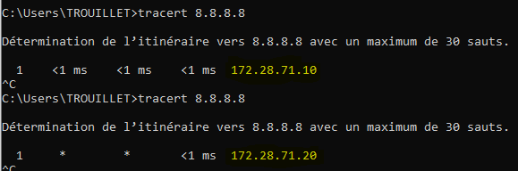

# Activation HSRP 

"HSRP est la solution active dans notre infrastructure"

## Étapes :

**Configuration de l'interface pour HSRP :**

`Gi0/0.233` (notre interface de transport)

Definit l'adresse VIP (Virtual IP) HSRP à 172.28.71.254 

`standby 1 ip 172.28.71.254` 

Definit la priorité du routeur à 110 qui sera superieur a celui de R2 qui est 100

`standby 1 priority 110` 

permet de reprendre le rôle de base pour R1 donc actif et R2 reviendra a passif

`standby 1 preempt` 

Et voilà , HSRP est desormais actif et fonctionnel .

