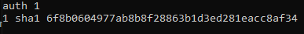

# Configuration de Heartbeat

## Prérequis
Installer Heartbeat sur les deux serveurs Proxy.
Intégrer les deux interfaces dans le fichier /etc/hosts

Exemple : 

Ce sera important pour le reste
### Fichiers de configuration de Heartbeat :

⚠️ Ne modifiez pas les fichiers présents dans /etc/heartbeat mais bien /etc/ha.d
⚠️ Ne surtout pas se tromper sur les noms des serveurs dans les fichiers
  
Fichier ha.cf :

  
Fichier contenant la clé privée :

  
Fichier contenant haresources (interface VIP) :

 
Entrer la commande sudo invoke.rc heartbeat restart

Vérifiez si cela fonctionne en entrant ip a