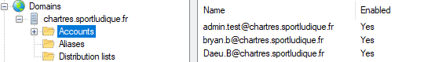
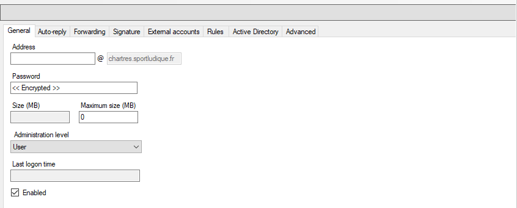
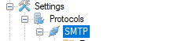
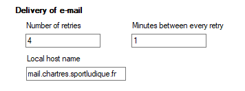
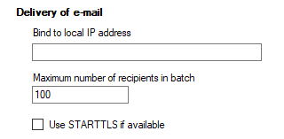

# Configuration Serveur Mail
Installation de HmailServer , Creation du compte d'administration

# Configuration du domaine ainsi que de la création des comptes utilisateurs

# Personalisation des paramètres SMTP

Aprés on va aller dans SMTP puis dans General ou l'on va mettre ces options là:

Puis nous allons aller dans advanced et il faudra décocher certaines options:

Retirer tous ce qui a dans bind to local IP address
et décocher la case STARTTLS if available
